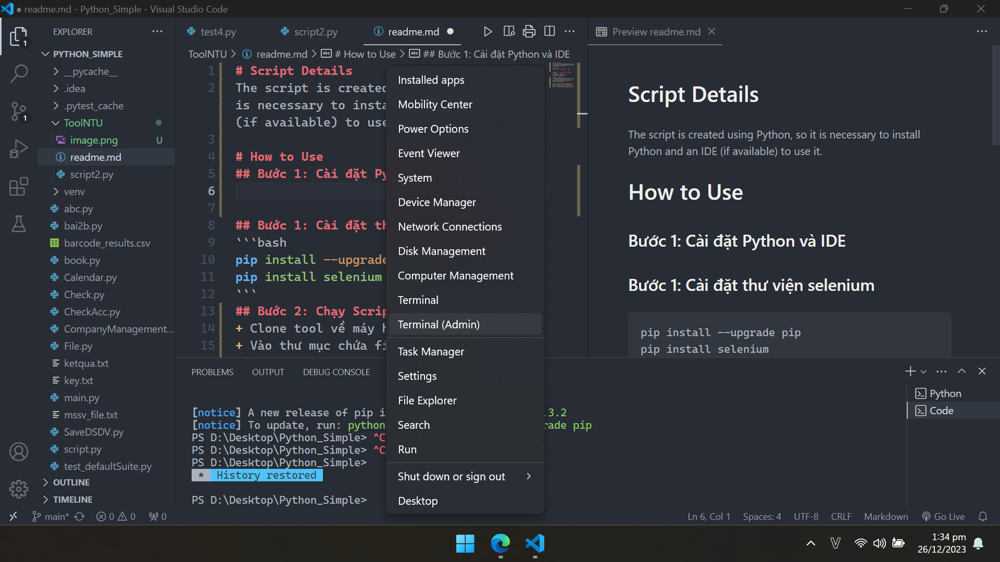
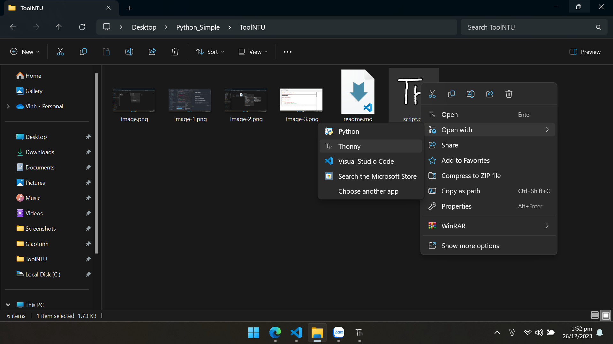
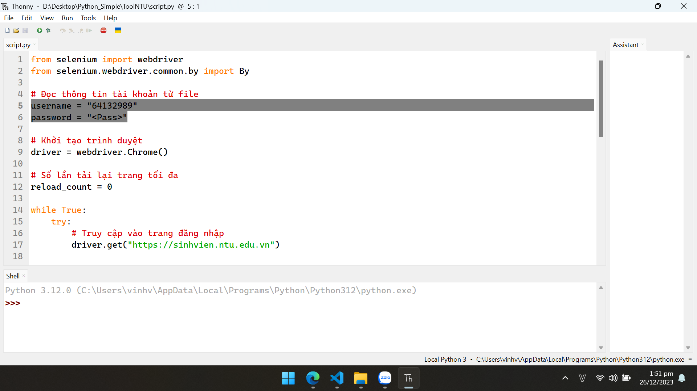
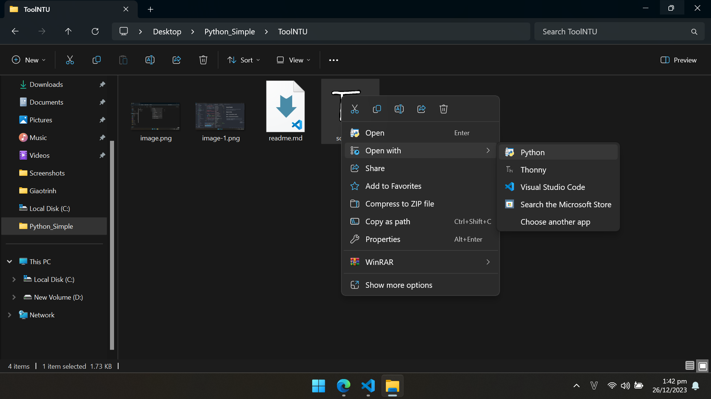

# Script Details
The script is created using Python, so it is necessary to install Python and an IDE (if available) to use it.

# How to Use
## Bước 1: Bật Windows Terminal
+ Chuột phải vào nút windows, chọn "Terminal (Admin)" như hình



## Bước 2: Cài đặt công cụ
+ Nhập vào hai lệnh sau để cài đặt Python và IDE (Thonny)
```bash
winget install Thonny
winget install Python
```
+ Nhập vào tiếp hai lệnh sau để cài đặt thư viện Selenium
```bash
pip install --upgrade pip
pip install selenium
```
## Bước 2: Chạy Script
+ Clone tool về máy hoặc tải file zip về
+ Vào thư mục chứa file `script.py`, chuột phải vào file `script.py`, chọn "Open with", chọn "Thonny", như hình



+ Sửa lại thông tin MSSV (username) và mật khẩu (password), như hình



+ Vào thư mục chứa file `script.py`, chuột phải vào file `script.py`, chọn "Open with", chọn "Python", như hình



+ Rồi, mặc kệ nó
+ Từ nay về sau cứ chạy script như vậy là ok

**Lưu ý: Tool chỉ vào trang đăng ký học phần cho nhanh, khỏi mất công bấm hư phím, còn đăng ký môn nào tự mà tick, làm cho nó tự tick mất công nó đăng ký lộn**